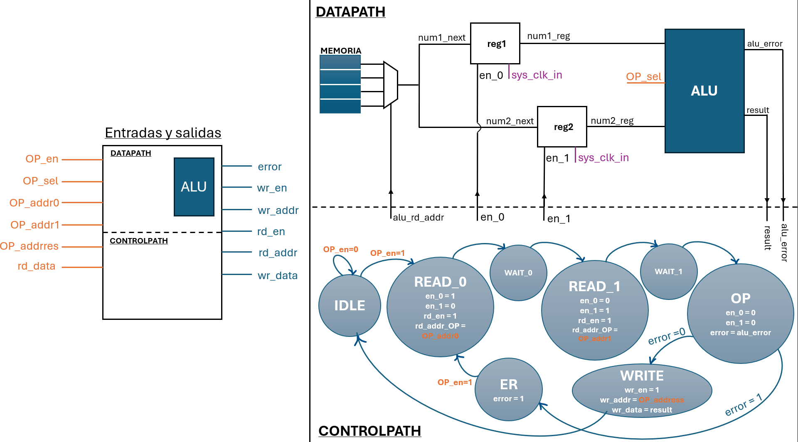
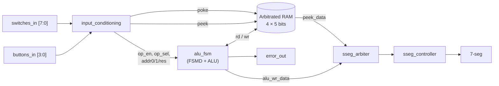
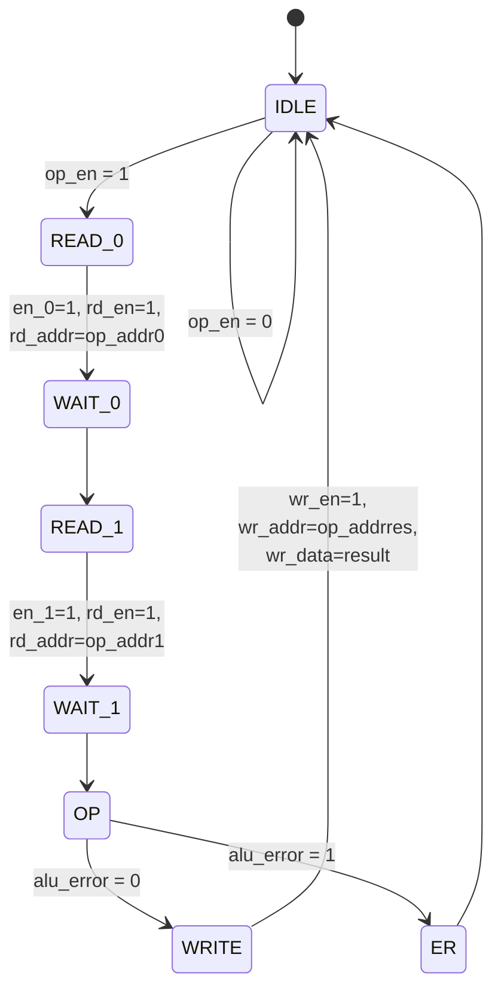
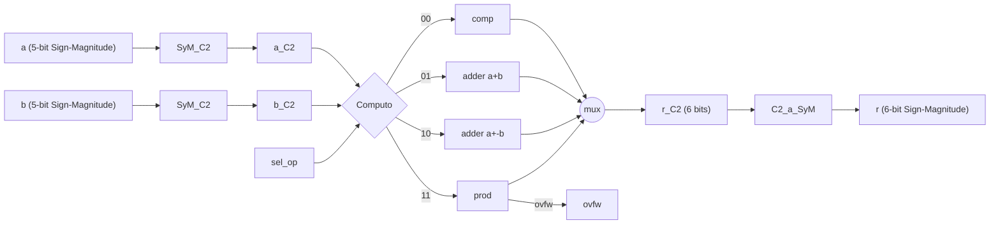

# ALU + FSM over a Register File (VHDL)

Digital Electronics III – Laboratory 3 — Telecommunications Engineering,  
**Instituto Balseiro**. This project reuses the ALU developed in Laboratory 1
and extends it with an FSMD (`alu_fsm`) that interfaces with an arbitrated
4×5-bit RAM, allowing operand selection, ALU execution, and writing the
result back into memory.

> The `alu_fsm` module is the only laboratory deliverable. The top-level
> (`alu_fsm_top.vhd`), testbench, and auxiliary modules
> (`arbitered_ram`, `input_conditioning`, `sseg_arbiter`,
> `sseg_controller`, and package `sdp_ram_pkg`) are provided by the course.

---

<p align="center">
  
</p>

---

## Contents

1. [Objective](#1-objective)
2. [System Architecture](#2-system-architecture)
3. [`alu_fsm` Module](#3-alu_fsm-module)
4. [ALU Reused from Lab 1](#4-alu-reused-from-lab-1)
5. [User Interface](#5-user-interface)
6. [Simulation](#6-simulation)
7. [Board Demonstration](#7-board-demonstration)
8. [Repository Organization](#8-repository-organization)
9. [Files](#9-files)
10. [Code Review](#10-code-review)

---

## 1. Objective

From the laboratory specification (`Enunciado_Lab3.pdf`):

> The goal is to reuse the ALU designed in Laboratory 1 and, through an
> appropriate control logic, connect it to a register file. This makes it
> possible to select values stored in memory, send them to the ALU, compute
> the desired operation, and write the result back into another register for
> later reuse.

The assignment consists of implementing the `alu_fsm` module with:

- one instance of the Lab 1 ALU configured for 5-bit inputs and a 6-bit output;
- an FSMD that starts on `op_en`, sequentially reads both operands from RAM,
  verifies that the result does not overflow and fits into the 5-bit
  sign-magnitude format, then writes the result to `op_addrres` or raises
  `error_out`, which is cleared only when a new operation begins.

---

## 2. System Architecture



This architecture is taken directly from the laboratory specification and
`alu_fsm_top.vhd`.

**Suggestion:** place the existing `diagrama.png` inside `docs/`. It already
contains the datapath, control path, and complete I/O description of
`alu_fsm`.

---

## 3. `alu_fsm` Module

### Datapath

Two enable-controlled registers (`reg1`, `reg2`) store the operands
sequentially read from RAM and feed them to the ALU. The FSM selects which
register receives each value through the `en_0` and `en_1` signals.

### FSM (8 States)



The `WAIT_*` states are required because the RAM has a one-clock latency
between `rd_en` and valid `rd_data`.

Total execution latency is **7 clock cycles** from the `op_en` pulse until
the `wr_en` write pulse.

### 6-bit → 5-bit Sign-Magnitude Conversion

The ALU produces a 6-bit sign-magnitude result (sign + 5-bit magnitude).
Before writing into the 5-bit RAM, the conversion is:

```vhdl
alu_wr_data <= result(N) & result(N-2 downto 0);
```

That is, the sign bit and the four least significant magnitude bits are
preserved, while the most significant magnitude bit is discarded.

---

## 4. ALU Reused from Lab 1

Hierarchy:

`TOP` → `SyM_C2` (×2) → `Computo` → `C2_a_SyM`

`Computo` instantiates `adder` (addition), another `adder` with `-b`
(subtraction), `prod`, and `comp`.



`sel_op` decoding (according to `OP.vhd`):

| `sel_op` | Operation |
|----------|-----------|
| `00` | Equality (`a == b` → returns `a`, otherwise `10...0`) |
| `01` | Addition |
| `10` | Subtraction |
| `11` | Multiplication (only operation capable of asserting `ovfw`) |

---

## 5. User Interface

Operation mode selection:

| Mode | SW7…SW6 | SW5…SW4 | SW3…SW2 | SW1…SW0 |
|------|----------|----------|----------|----------|
| POKE | — | `poke_data` | `poke_data` | `poke_addr` |
| PEEK | — | — | — | `peek_addr` |
| OP | `op_sel` | `op_addr1` | `op_addr0` | `op_addrres` |

Buttons:

| BTN | Function |
|-----|----------|
| 0 | `poke_en` |
| 1 | `peek_en` |
| 2 | `op_en` |
| 3 | `sys_rst` |

---

## 6. Simulation

The testbench (`alu_fsm_top_test.vhd`) instantiates `alu_fsm_top` with
`SIM_ONLY = '1'` and performs the following sequence:

1. Synchronous reset.
2. POKE `−10` into address 3.
3. POKE `+3` into address 2.
4. PEEK address 2.
5. Execute an operation with `sel_op = "10"`, `addr0 = 3`,
   `addr1 = 2`, `addrres = 1`.
6. POKE `−2` into address 3.
7. Repeat the operation.

In the waveform (`Sim.png`), around **674 ns**:

- `mem = 0, 5, 3, -2`
- `num1_reg = 3`, `num2_reg = -2`
- `state_reg` follows

```
IDLE → READ_0 → WAIT_0 → READ_1 → WAIT_1 → OP → WRITE → IDLE
```

- `result = 5` is written into address 1.

With `sel_op = "10"` (subtraction), the ALU computes

```
3 − (−2) = 5
```

which matches the operation decoding implemented in `OP.vhd`.


---

## 7. Board Demonstration

Include the demonstration video as `docs/demo.mp4`, or upload it to YouTube
and link it here.

The recommended demonstration should show:

- POKE of two values using the switches.
- PEEK verifying the stored values.
- ALU operation (addition, subtraction, or multiplication) with the result
  displayed on the seven-segment display.
- A case that triggers `error_out`.

Markdown example:

```markdown
[](docs/demo.gif)
```

---

## 8. Repository Organization

```text
lab3/
├── README.md
├── docs/
│   ├── diagrama.png              # Block diagram + FSM
│   ├── Sim.png                   # Simulation waveform
│   ├── Enunciado_Lab3.pdf        # Original assignment
│   └── demo.mp4                  # Board demonstration
├── rtl/
│   ├── alu/
│   │   ├── TOP.vhd
│   │   ├── SyM_C2.vhd
│   │   ├── C2_SyM.vhd
│   │   ├── OP.vhd
│   │   ├── adder.vhd
│   │   ├── prod.vhd
│   │   └── comp.vhd
│   ├── fsm/
│   │   └── alu_fsm.vhd           # Main deliverable
│   └── top/
│       └── alu_fsm_top.vhd       # Provided by the course
└── sim/
    └── alu_fsm_top_test.vhd      # Provided testbench
```

---

## 9. Files

| File | Source | Purpose |
|------|--------|---------|
| `alu_fsm.vhd` | This work | FSMD controlling the ALU and RAM |
| `TOP.vhd` | Lab 1 | ALU wrapper (Sign-Magnitude input/output) |
| `SyM_C2.vhd` | Lab 1 | Sign-Magnitude → Two's Complement converter |
| `C2_SyM.vhd` | Lab 1 | Two's Complement → Sign-Magnitude converter |
| `OP.vhd` | Lab 1 | Operation selector and output multiplexer |
| `adder.vhd` | Lab 1 | Sign-extended adder |
| `prod.vhd` | Lab 1 | Multiplier with overflow detection |
| `comp.vhd` | Lab 1 | Equality comparator |
| `alu_fsm_top.vhd` | Course | Complete top-level design |
| `alu_fsm_top_test.vhd` | Course | Testbench |

---

## 10. Code Review

### Strengths

- `alu_fsm` follows the classical three-process FSM architecture
  (state register, next-state logic, output logic), producing clean and
  synthesizable code.
- The `en_0` and `en_1` enables driving `num1_reg` and `num2_reg`
  match the datapath shown in `diagrama.png`.
- Sensitivity lists are complete.

### Possible Improvements

- The `ER` state transitions unconditionally to `IDLE` on the next clock,
  causing `error_out` to remain asserted for only one cycle. The assignment
  specifies that it should remain high until the next operation begins.
- Overflow detection only checks `alu_error`, which in `OP.vhd` is gated by
  `sel_op = "11"`. Addition and subtraction may silently truncate results
  when executing

  ```vhdl
  result(N) & result(N-2 downto 0)
  ```

  if `result(N-1) = '1'`.

- `state_reg`, `num1_reg`, and `num2_reg` are not reset, so they begin as
  `'U'` during simulation.
- Commented-out code remains inside `WAIT_0` and `WAIT_1`; it would be cleaner
  to remove it or document why it is kept.
- Assignments such as

  ```vhdl
  num1_reg <= num1_reg;
  ```

  are redundant, since the register naturally holds its value when the
  enable is deasserted.
- The `adder`, `prod`, and `comp` blocks each include an `en` input that
  forces the output to zero. This extra logic is unnecessary because the
  `Computo` multiplexer already selects the active result.
- Subtraction uses a **second** `adder` instance with `-b`. The design could
  be optimized by sharing a single adder and multiplexing its `b` input.
